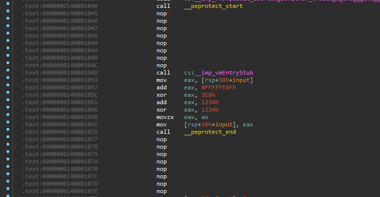
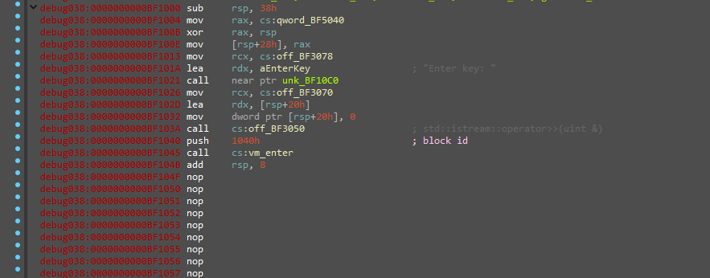

# PEProtect

A PE file packer for Windows x64.

> [!IMPORTANT]
> **Educational Purposes Only:** This project is created strictly for educational and research purposes to understand the inner workings of the PE file format, loaders, and memory management in Windows. It is not intended for malicious use or deployment in production environments.

## Features

* Reads the original EXE, parses sections, the import table, and relocations.
* Manually restores everything at runtime.
* Manually resolves function addresses using the PEB.

## Analysis & Tests

## Screenshots

<p align="center">
  <b>Before (Original File)</b><br>
  
</p>

<br>

<p align="center">
  <b>After (Packed with PEProtect)</b><br>
  
</p>

<p align="center">
  <em>Example of a file before and after packing with PEProtect</em>
</p>

You can check out the VirusTotal test results for a sample file processed with this tool:
* [VirusTotal Report (Before Packing)](https://virustotal.com)
* [VirusTotal Report (After Packing)](https://virustotal.com)

## Building

### Prerequisites
* Visual Studio 2022+
* ZSTD
* CMake

### Commands
```cmd
cmake -S . -B build
cmake --build build --config Release
```

## Usage

```text
Usage: PEProtect input.exe [options]

Options:
  -printData    Print data dump for debugging
  -noreloc      Remove relocation table
  -showSection  Prints info about all sections

Example:
  PEProtect target.exe -printData
  PEProtect calc.exe
```

## Code Virtualization Integration Guide

To protect sensitive parts of your C/C++ code using virtualization, you need to configure your Visual Studio project to link against the PEProtect SDK libraries:

1. **Include Directories:** Add the `include` folder from the PEProtect SDK to your project's **Additional Include Directories** (*C/C++ -> General -> Additional Include Directories*).
2. **Library Directories:** Add the path to the PEProtect static libraries to your **Additional Library Directories** (*Linker -> General -> Additional Library Directories*).
3. **Linker Dependencies:** Add `PEProtect_lib.lib` and `PEProtect_dyn.lib` to your **Additional Dependencies** (*Linker -> Input -> Additional Dependencies*).

### Code Example

Wrap the target code block with `PEPROTECT_START()` and `PEPROTECT_END()` markers:

```cpp
#include <iostream>
#include <PEProtect.h>

int main() {
    std::cout << "Enter key: ";

    unsigned int input = 0;
    std::cin >> input;

    PEPROTECT_START();

    unsigned int a = input;
    a -= 337;
    a ^= 1000;

    a += 0x1234;
    unsigned int c = a;
    c <<= 4;

    unsigned int d = 0x0F;
    c |= d;
    c >>= 4;

    c &= 0xFFFF;
    input = c ^ 0x1234;

    PEPROTECT_END();

    if (input != 0) { // key is 1337
        std::cout << "Wrong key!\n";
    }
    else {
        std::cout << "Success!\n";
    }

    return 0;
}
```

### Disassembly Comparison

Here is how the protected block looks under the hood before and after compilation with virtualization enabled:

<p align="center">
  <b>Before Virtualization (Original Code Assembly)</b><br>
  
</p>

<br>

<p align="center">
  <b>After Virtualization (VM Entry Point)</b><br>
  
</p>

<p align="center">
  <em>The original mathematical operations are fully obscured and replaced by the execution entry point of the internal virtual machine.</em>
</p>

## To-Do

- [ ] **Mutation Engine** Junk code insertion & instruction substitution.
- [ ] **Anti-Debugging** `IsDebuggerPresent`, PEB checks & `RDTSC` timing.
- [ ] **Code Virtualization** Custom bytecode interpreter for sensitive functions.
  - [ ] Support for basic mathematical instructions only.
  - [ ] *Note: Control flow instructions (e.g., `jmp`, `call`, `jnz`, `jz`) are not yet implemented.*
